## STEM:

Q. How to load in colab notebook?
        - Visit the page and copy the link
        - use gdown in colab notebook

### 1) Has Graphene datasets (HAADF, time series HAADF's, spectrum images)- [Gdrive link](https://drive.google.com/drive/folders/1u0z4pkZJN8Q00zt_QyEWHpckuFJ_z3iZ?usp=drive_link) - credits: Austin Houston

##### Recomended tasks on the data: atom/feature finding, drift computation(time series data), strain calculation, particle analytics.

Few examples:

  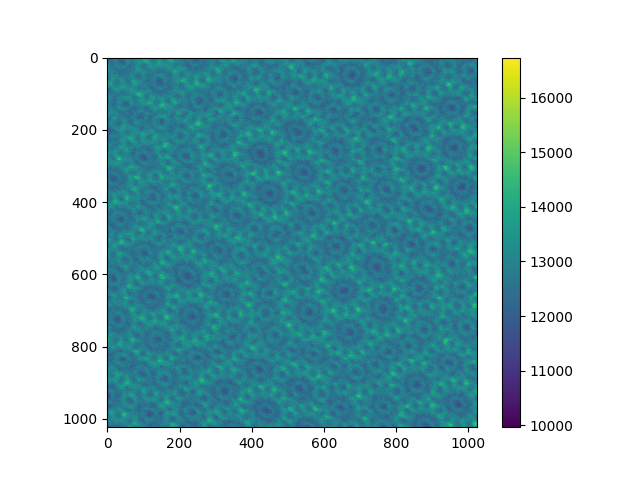
  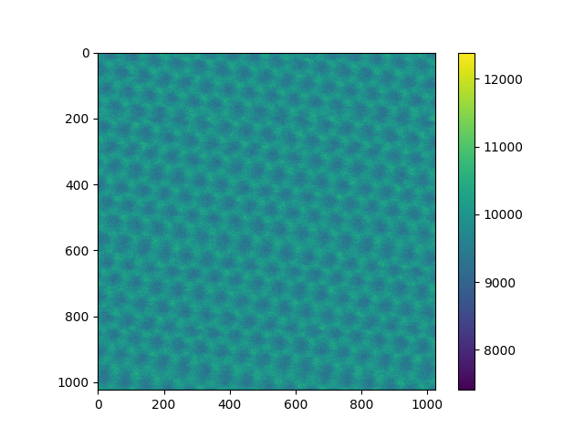
  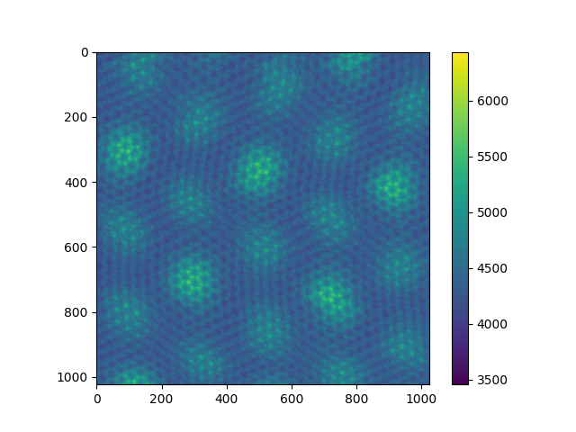

### 2) Has MoS2 monolayer datasets (HAADF, time series HAADF's, spectrum images)- [Gdrive link](https://drive.google.com/drive/folders/1mkY9KlfnZXsvFfHLFujNmMPx4YTE0yxD?usp=drive_link) - credits: Austin Houston

##### Recomended tasks on the data: atom/feature finding, drift computation(time series data), strain calculation, particle analytics.

Few examples:

  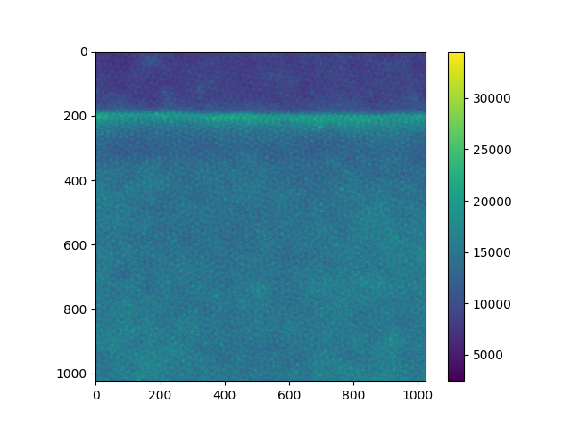
  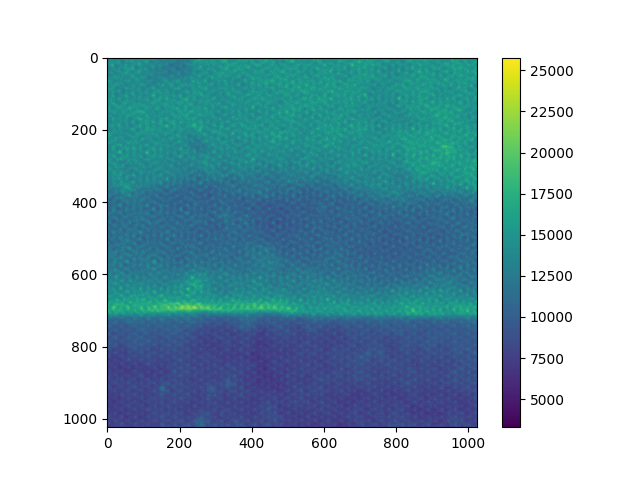
  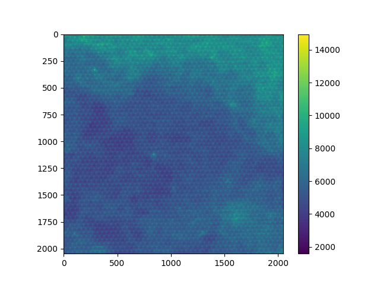

### 3) Has SnSe datasets(HAADF)- [Gdrive link](https://drive.google.com/drive/folders/1lwFqZnVGk0qjoRYeKAJoNuI90vm7Nnos?usp=drive_link) - credits: Austin Houston

##### Recomended tasks on the data: atom/feature finding, drift computation(time series data), strain calculation, particle analytics.

Few examples:

  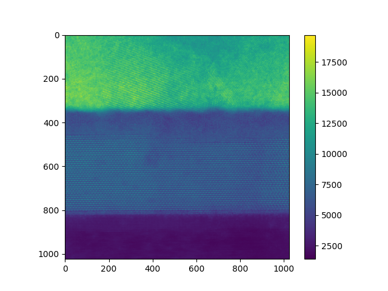
  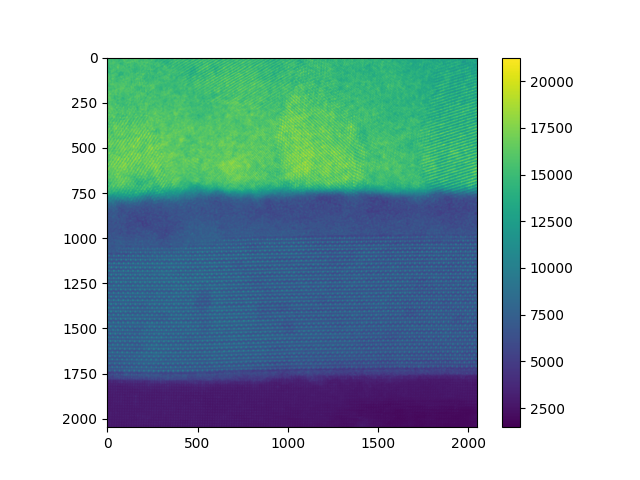

### 4) Has 12 spectrum image datasets - [Gdrive link](https://drive.google.com/drive/folders/1qUwUopeyzAXqVQ3ROs3XEBmW9yY9Yrn6?usp=drive_link) - credits: Kevin Roccapriore

##### Recomended tasks on the data: feature finding, strucutre-property relationship, active learning

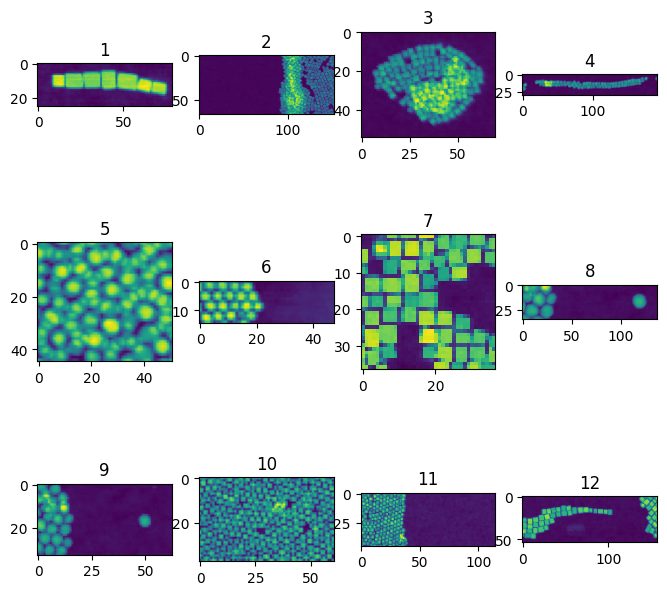

example: 

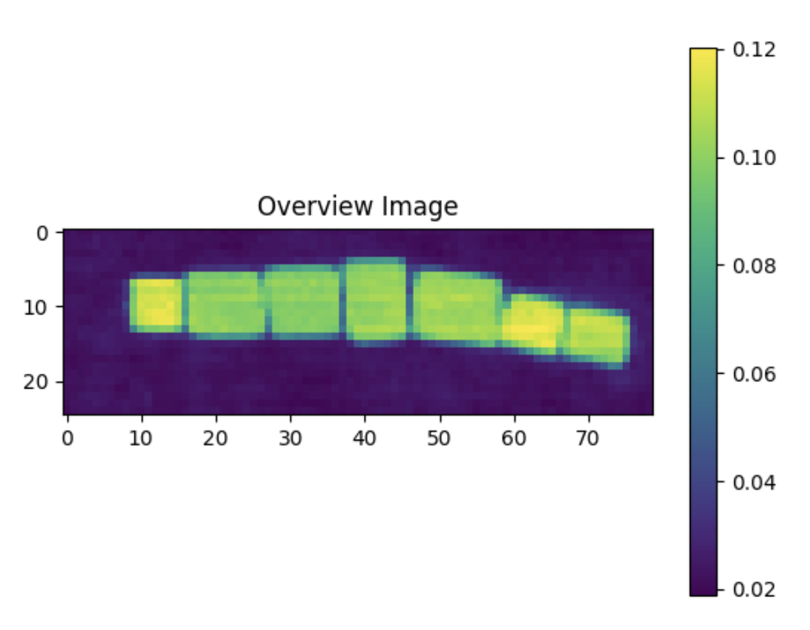
`!gdown https://drive.google.com/uc?id=1HImDBthWtz4ElGTs6B5kOhDR70V5_XtF`

### 5) Has 3 datasets of MoS2 with Mo6S6 Nanowire structures and various FOV, image quality, dopants, and degrees of contaminations - [Gdrive link](https://drive.google.com/drive/folders/18BkhR-fbuuavqN7LAtrvWeJmxP-p2WXS?usp=drive_link) - credits: Zijie Wu, Matthew Boebinger, Kevin Roccapriore

##### Recomended tasks on the data: feature finding, denoising, drift computation (for time series data)

Few examples:

  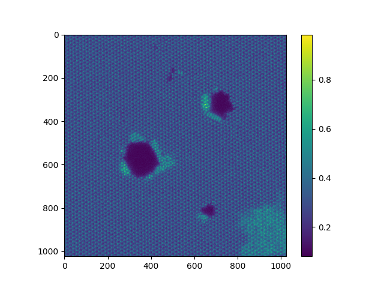
  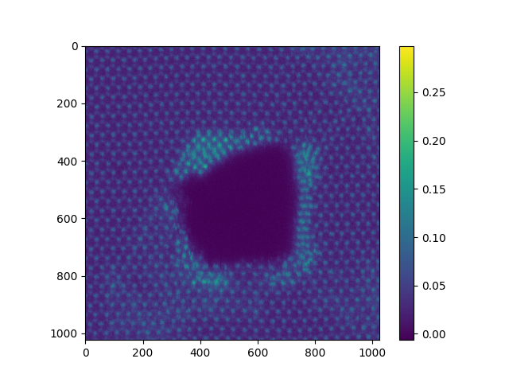

